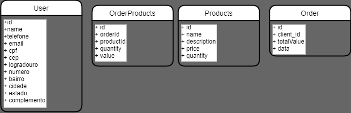
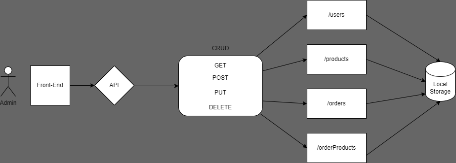

# Api Código do Futuro

## Desafio

*Visando melhorar a experiência de seus associados, como Farmarcas iremos desenvolver um sistema chamado Radar, onde o seu objetivo é gerenciar o Fluxo de caixa do lojista fazendo com que o mesmo tenha a possibilidade de fazer o gerenciamento do fluxo de entrada e saída do seu negócio*

*Persistência:
Iremos gravar as informações em uma API Node.js com persistência em disco com arquivo.json para isso devemos:*

- [x] Criar uma API em Node.js básica
- [x] Fazer os CRUD's de Produtos, Clientes, Pedidos, PedidosProdutos, salvando os dados em arquivo.json.

## Solução

- Abstração das classes **modelos**

- Fluxo de implementação da **API-REST**

### EndPoints

- [x] ``/products`` - **REFERENTE à** Produtos (id, nome, descricao, valor, qtd_estoque)
  - [x] GET
  - [x] POST
- [x] ``/products/id`` - **REFERENTE à** Produtos (id, nome, descricao, valor, qtd_estoque)
  - [x] PUT
  - [x] DELETE
- [x] ``users`` - **REFERENTE à** Clientes (id, nome, telefone, email, cpf, cep, logradouro, numero, bairro, cidade, estado e complemento)
  - [x] GET
  - [x] POST
- [x] ``users/id`` - **REFERENTE à** Clientes (id, nome, telefone, email, cpf, cep, logradouro, numero, bairro, cidade, estado e complemento)
  - [x] PUT
  - [x] DELETE
- [x] ``orders`` - **REFERENTE à** Pedidos (id, cliente_id, valor_total, data)
  - [x] GET
  - [x] POST
- [x] ``orders/id`` - **REFERENTE à** Pedidos (id, cliente_id, valor_total, data)
  - [x] PUT
  - [x] DELETE
- [x] ``ordersProduct`` - **REFERENTE à** PedidosProdutos (id, pedido_id, produto_id, valor, quantidade)
  - [x] GET
  - [x] POST
- [x] ``ordersProduct/id`` - **REFERENTE à** PedidosProdutos (id, pedido_id, produto_id, valor, quantidade)
  - [x] PUT
  - [x] DELETE

### Configurações do Projeto

1. `npm init`
2. `npm install`

- **Dependências** utilizadas
  - [cookie-parser]()
  - [cors]()
  - [debug]()
  - [express]()
  - [http-errors]()
  - [morgan]()
  - [nodemon]() **Dependência de desenvolvimento**

3. criação dos scripts
   - `npm run start`
   - `npm run dev`

## Testes

- Foram desenvolvidas *Collections* no *Thunder Client* simulando as requisições http para os endPoints criados afim de testar o funcionamento esperado das requisições.

## Integrantes

- [Ariel Rodrigues](https://github.com/99arielsr)
- [Guilherme Bonilha](https://github.com/bonilha-rogante)
- [Luan Fonseca](https://github.com/Luanftg/)
- [Victor Pinheiro](https://github.com/VictorPnheiro)
- [Sarah Cardoso]()

### Referências

- [Link com informações do Projeto Integraor](https://docs.google.com/document/d/1t7k1-_LaiIV_jeNg0f1EuuDUcSINUSWQ/edit#)
- [Repositório - Danilo](https://github.com/torneseumprogramador/codigo-do-futuro-api-fake)
- [Torne-se um Programador - Async Await](https://www.torneseumprogramador.com.br/aula?id=3OalpxsCvTY&aula=101&tipo=back-end&professor=Danilo)
